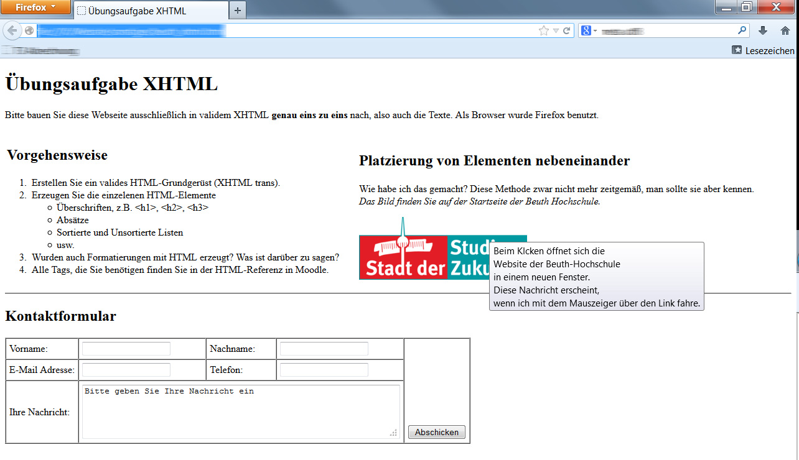

# Web_Prog

Modul Web-Programmierung SoSe19

## Aufgabe 1 - Nachbau einer vorgegebenen XHTML-Website
 

## Aufgabe 2 - Eigenes CSS Zen Garden Design erstellen
Für weitere Informationen siehe: http://www.csszengarden.com
 

## Aufgabe 3 - Geolocation API und Google Maps API
Anzeigen der eigenen Koordinaten, Darstellung in Google Maps und
Berechnung der Entfernung zur Beuth Hochschule für Technik
